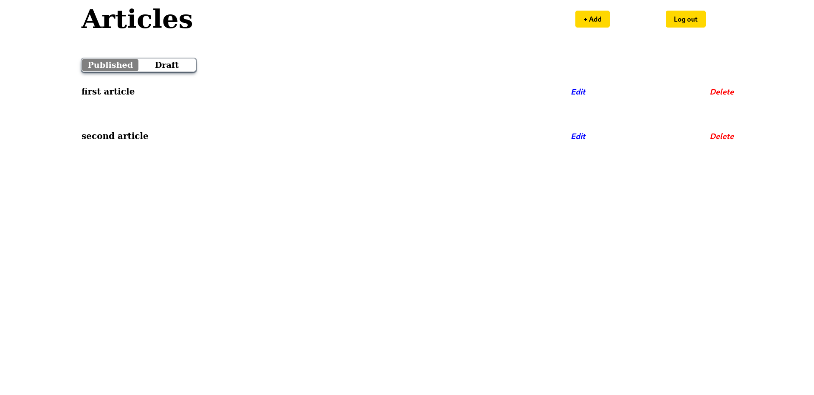
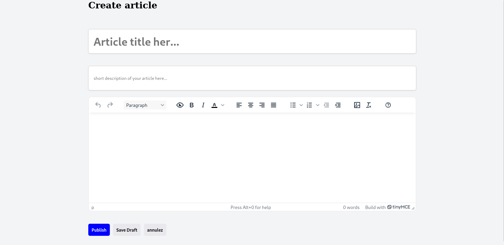

# ADMIN BLOG PANEL

A web application that allows users to create and manage blog posts. this also the client-side of [my personal blog api](https://github.com/johnOfGod33/Personal-Blog-API)





## FEATURES

- **User Authentication and Authorization**: Secure sign up and login

- **Get Articles**: Retrieve both published and draft articles.

- **Post New Article**: Users can create rich text blog posts with images and links using TinyMCE.

- **Edit Article**: Modify any existing post.

- **Delete Article**: Permanently remove an article.

## TECH

- React js

- SASS

- [TinyMCE](https://www.tiny.cloud/)

## USAGE

### REQUIREMENTS

- Node.js
- npm
- [TinyMCE Cloud Account](https://www.tiny.cloud/get-tiny/?utm_campaign=mlh_devrel_global_hackweek&utm_source=mlh&utm_medium=referral&utm_term=github) (allow you to get your api key)

### INSTALLATION

```bash
# clone repo

git clone https://github.com/johnOfGod33/admin-blog-panel.git

# go to the directory

cd admin-blog-panel

# create environment variable file

touch .env

# add your tiny api key

echo "REACT_APP_TINY_API_KEY=your_api_key" >> .env

# install dependencies
npm i

# run the project

npm start
```
