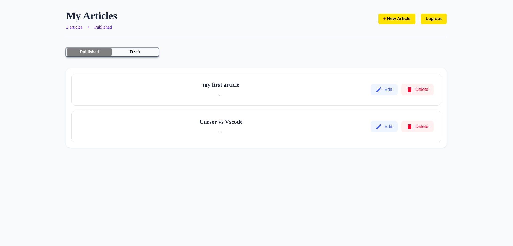

# ADMIN BLOG PANEL

A web application that allows users to create and manage blog posts. this also the client-side of [my personal blog api](https://github.com/johnOfGod33/Personal-Blog-API)




## FEATURES

- **User Authentication and Authorization**: Secure sign up and login

- **Get Articles**: Retrieve both published and draft articles.

- **Post New Article**: Users can create rich text blog posts with images and links using Editor.js.

- **Edit Article**: Modify any existing post.

- **Delete Article**: Permanently remove an article.

## TECH

- React js

- SASS

- [Editor.js](https://editorjs.io/)

## USAGE

### REQUIREMENTS

- Node.js
- npm

### INSTALLATION

```bash
git clone https://github.com/johnOfGod33/admin-blog-panel.git

cd admin-blog-panel

npm i

npm start
```
